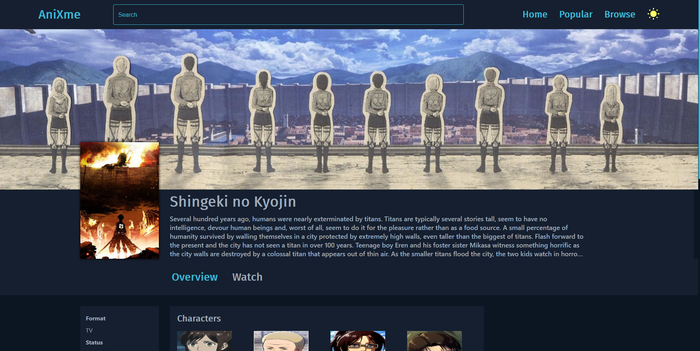
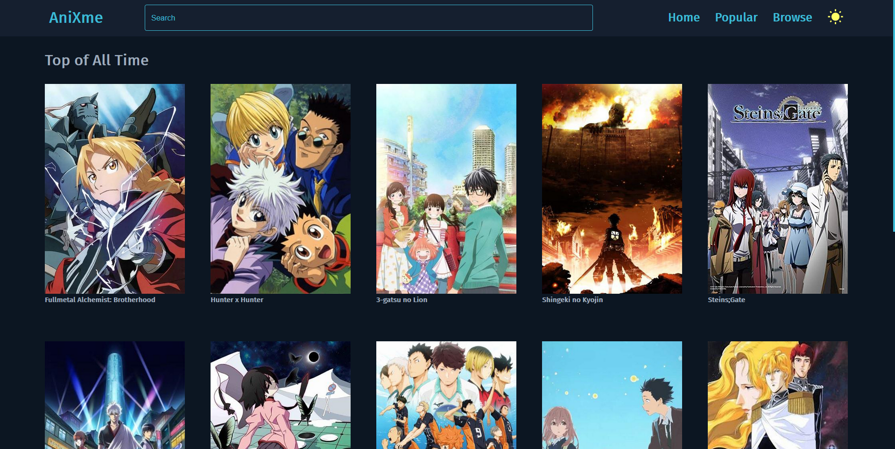
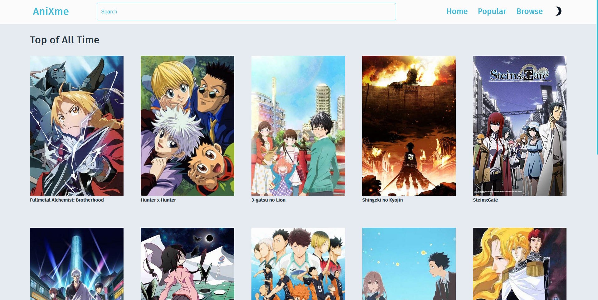
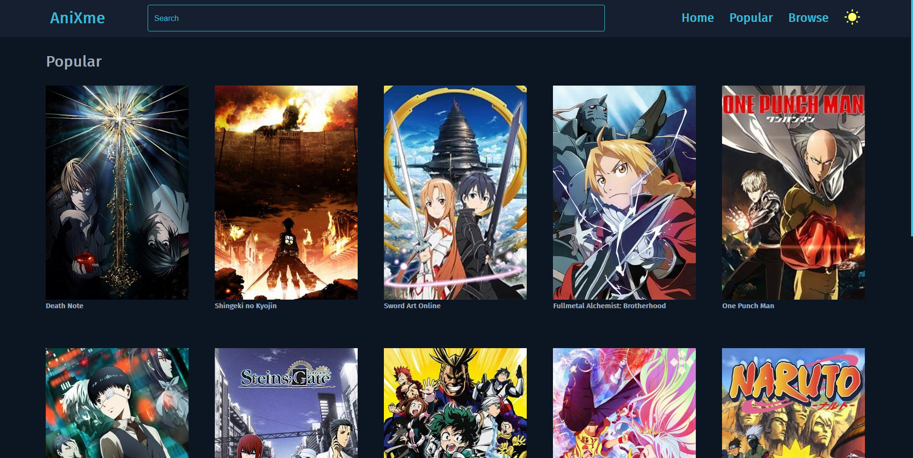
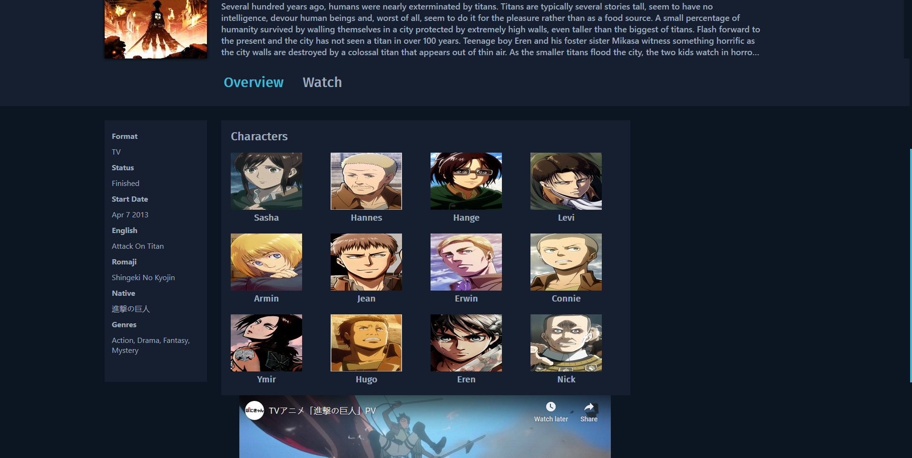
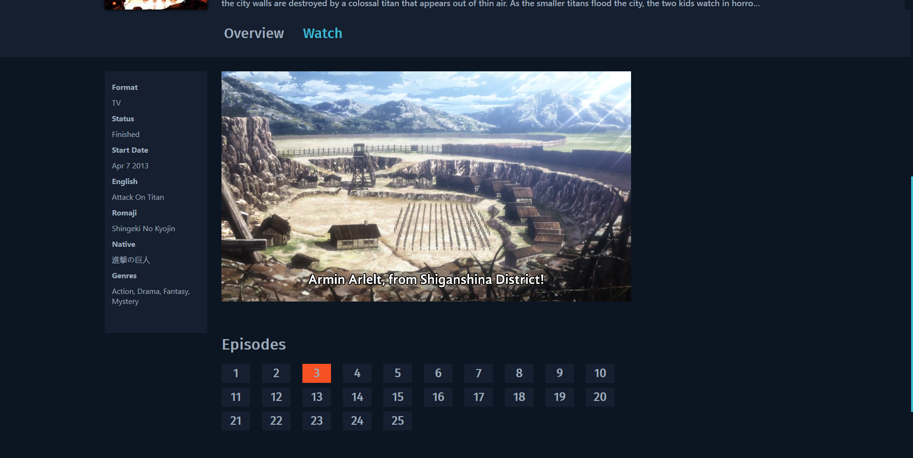
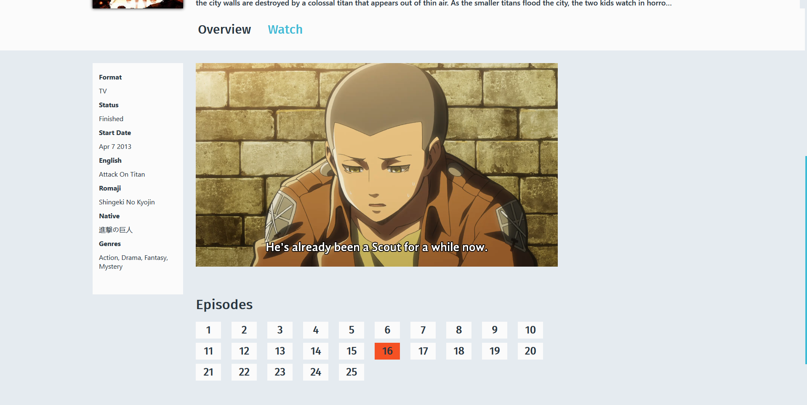
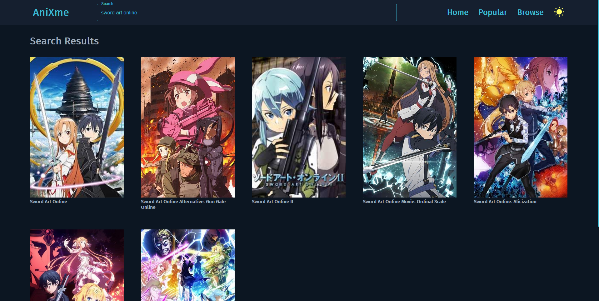

# Anixme

Anixme is an anime streaming platform allowing you to watch anime using links scraped from the interent using Python's beautifulSoup library. Anixme is built using the MERN Stack (MongoDB, Express, React, Node).

The frontend of Anixme is built in React. The data scraped using beautifulSoup is hosted on MongoDB and retrieved through Node/Express. Other information about the Anime is retrieved through the Anilist GraphQL API.

## Features

1. Search anime
2. Get top of all time anime
3. Get most popular anime
4. Browse anime
5. Watch anime
6. Download anime (right click and save video)
7. Dark / Light Theme
8. Watch trailers and access other interesting info

## Watch the Demo

## UI

### Home

### Popular Animes

### Anime

### Anime Overview

### Video

### Search Results

## Mobile

